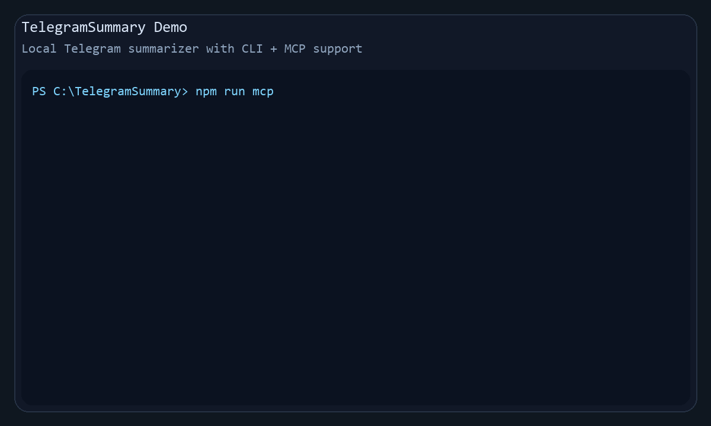

# Telegram Digest MCP

Local CLI and MCP server for reading Telegram chats your account already has access to and generating structured LLM summaries.

It does not join chats, impersonate another person, or bypass Telegram access controls. You authenticate explicitly with your own account and work only with dialogs already available to that account.

## Why This Exists

Telegram groups and channels can be noisy, high-volume, and hard to review after the fact.

This project turns chats you already have access to into:

- concise summaries
- structured JSON for automation
- readable HTML reports
- MCP tools that other AI clients can call

## Highlights

- local Telegram session, no Telegram bot required
- CLI and MCP server on top of the same core logic
- multilingual summaries
- incremental mode with checkpoints
- markdown, JSON, and HTML outputs
- practical sections like decisions, useful info, useful links, deadlines, and action items

## Demo



The demo GIF shows:

- starting the MCP server
- calling `summarize_dialog`
- getting a structured summary with practical sections
- saving markdown, JSON, and HTML reports

## Quick Start

1. Install dependencies:

```bash
npm install
```

2. Copy `.env.example` to `.env` and fill in your values:

```env
TELEGRAM_API_ID=
TELEGRAM_API_HASH=
TELEGRAM_PROXY_PROTOCOL=
TELEGRAM_PROXY_HOST=
TELEGRAM_PROXY_PORT=
TELEGRAM_PROXY_SOCKS_TYPE=5
TELEGRAM_PROXY_USERNAME=
TELEGRAM_PROXY_PASSWORD=
LLM_PROXY_HOST=
LLM_PROXY_PORT=
LLM_PROXY_PROTOCOL=socks5
LLM_PROXY_USERNAME=
LLM_PROXY_PASSWORD=
LLM_PROVIDER=opencode-go-openai
LLM_MODEL=glm-5
SUMMARY_LANGUAGE=en
GO_API_KEY=
RUN_MODE=full
MESSAGE_LIMIT=300
LLM_MAX_OUTPUT_TOKENS=8000
SUMMARY_CONCURRENCY=3
MERGE_WINDOW_MINUTES=10
```

3. Get Telegram API credentials at [my.telegram.org](https://my.telegram.org).

4. Run the interactive CLI once to create a local Telegram session:

```bash
npm start
```

5. After the first successful login, you can either:

```bash
npm start
```

or:

```bash
npm run mcp
```

## What It Does

- logs into Telegram with your own account
- lists dialogs already available to that account
- fetches text messages for a selected period
- cleans and merges messages before summarization
- summarizes in chunks and produces a final report
- saves all output formats by default, or only selected ones
- supports incremental summaries via checkpoints
- exposes the same logic through MCP tools

## Typical Use Cases

- summarize noisy Telegram groups once a day or week
- extract decisions, action items, and useful links from project chats
- create structured chat digests for knowledge capture
- let MCP-compatible clients query your Telegram history through tools

## Installation Notes

If Telegram access must go through a local SOCKS proxy, set:

```env
TELEGRAM_PROXY_PROTOCOL=socks5
TELEGRAM_PROXY_HOST=127.0.0.1
TELEGRAM_PROXY_PORT=8080
TELEGRAM_PROXY_SOCKS_TYPE=5
```

If Telegram access must go through a plain HTTP proxy such as `opera-proxy`, set:

```env
TELEGRAM_PROXY_PROTOCOL=http
TELEGRAM_PROXY_HOST=127.0.0.1
TELEGRAM_PROXY_PORT=8080
```

LLM proxy settings are separate from Telegram and do not fall back to `TELEGRAM_PROXY_*`.

If LLM traffic must go through a plain HTTP proxy, set:

```env
LLM_PROXY_HOST=127.0.0.1
LLM_PROXY_PORT=8080
LLM_PROXY_PROTOCOL=http
LLM_PROXY_USERNAME=
LLM_PROXY_PASSWORD=
```

If LLM traffic must go through a SOCKS proxy, set:

```env
LLM_PROXY_HOST=127.0.0.1
LLM_PROXY_PORT=1080
LLM_PROXY_PROTOCOL=socks5
LLM_PROXY_USERNAME=
LLM_PROXY_PASSWORD=
```

## CLI Usage

Interactive mode:

```bash
npm start
```

Direct run with arguments:

```bash
node src/index.js --chat "My Group" --limit 500 --period week
```

Optional flags:

- `--chat` dialog number, title fragment, or dialog id
- `--limit` number of latest messages to read
- `--dialogs` how many dialogs to show in the picker
- `--dialog-period` one of `day`, `week`, `month`, `all` for filtering the dialog list by recent activity
- `--provider` override `LLM_PROVIDER`
- `--model` override `LLM_MODEL`
- `--language` override `SUMMARY_LANGUAGE`
- `--mode` one of `full`, `incremental`, `changes`
- `--period` one of `day`, `week`, `month`, `all`
- `--output-format` one format or a comma-separated list: `messages`, `markdown`, `structured`, `html`, `all`
- `--include-profile-links` fetch sender profiles, cache them, and add a separate report section for links found in profile text

Examples:

```bash
node src/index.js --chat "My Group" --period week --output-format html
node src/index.js --chat "My Group" --period week --output-format markdown,html
node src/index.js --chat "My Group" --period week --include-profile-links --output-format html
```

Runtime settings:

- `SUMMARY_CONCURRENCY` controls how many chunks are summarized in parallel
- `LLM_MAX_OUTPUT_TOKENS` controls the maximum size of each LLM response
- `PROFILE_CACHE_TTL_DAYS` controls how long cached Telegram profiles are reused, default `14`
- `PROFILE_LINK_AUTHOR_MESSAGE_LIMIT` controls how many recent messages per author are used for profile-link analysis, default `25`
- `PROFILE_LINK_AUTHOR_CHAR_LIMIT` controls the maximum message sample size per author, default `6000`

## Run Modes

- `full` summarize the selected period from scratch
- `incremental` summarize only new messages since the last successful summary for the same dialog and period
- `changes` same as `incremental`, but framed as what changed since the previous summary

## LLM Providers

LLM providers and model lists are configured in `config/llm-providers.json`.

The selected working pair is:

- `LLM_PROVIDER`
- `LLM_MODEL`

You can override both for one run:

```bash
node src/index.js --provider opencode-go-openai --model glm-5 --language en
```

## Summary Languages

Supported summary languages:

- `en` English, default
- `ru` Russian
- `es` Spanish
- `de` German
- `fr` French
- `zh-cn` Simplified Chinese

Language-specific headings and report strings are configured in `config/summary-languages.js`.

## Output Files

Files are written to `output/`:

- `*.messages.json` raw normalized messages
- `*.summary.md` markdown summary with stats, table of contents, short version and full version
- `*.summary.json` structured summary payload with extracted sections and parsed bullet arrays
- `*.summary.html` readable HTML report

By default the app writes all four files. You can limit this in CLI with `--output-format` or in MCP with `outputFormats`.

The app also stores:

- `.telegram-session.txt` local Telegram session
- `.cache/summary-chunks/` cached chunk summaries
- `.state/checkpoints.json` per-dialog summary checkpoints

## MCP Server

The project includes a local MCP server over stdio:

```bash
npm run mcp
```

Before using MCP, run `npm start` once and complete Telegram login.

### Available MCP Tools

- `list_dialogs`
- `get_dialog_messages`
- `summarize_dialog`
- `list_llm_providers`
- `list_summary_languages`
- `get_last_summary`

### MCP Tool Examples

`list_dialogs`

```json
{
  "activityPeriod": "week"
}
```

`get_dialog_messages`

```json
{
  "dialogRef": "My Group",
  "period": "week",
  "limit": 200,
  "preprocess": true
}
```

`summarize_dialog`

```json
{
  "dialogRef": "My Group",
  "period": "month",
  "mode": "incremental",
  "provider": "opencode-go-openai",
  "model": "glm-5",
  "language": "en",
  "saveOutputs": true,
  "outputFormats": ["markdown", "html"]
}
```

`get_last_summary`

```json
{
  "dialogRef": "My Group",
  "period": "month",
  "includeMarkdown": true,
  "includeStructured": true
}
```

## MCP Client Config Examples

Example idea for an MCP client that launches a local stdio server:

```json
{
  "mcpServers": {
    "telegram-summary": {
      "command": "node",
      "args": ["C:\\Users\\you\\path\\to\\telegram-digest-mcp\\src\\mcp-server.js"],
      "cwd": "C:\\Users\\you\\path\\to\\telegram-digest-mcp"
    }
  }
}
```

If your client supports environment injection, you can also point it at the same project folder and `.env`.

## Data Privacy

This project can handle sensitive chat content.

Review and protect:

- `.env`
- `.telegram-session.txt`
- `.state/checkpoints.json`
- `.cache/summary-chunks/`
- `output/`

Also remember:

- message content may be sent to external LLM providers
- generated summaries can contain sensitive internal details
- cached chunk summaries may preserve partial chat content locally

## Legal and Safe Use

This tool is intended for:

- your own account
- chats you already have legitimate access to
- summarization and analysis workflows you are authorized to perform

It is not intended for:

- impersonation
- hidden data collection from third parties
- bypassing Telegram permissions or access controls

## Troubleshooting

If MCP says there is no Telegram session:

- run `npm start` once and complete login

If Telegram hangs on connect:

- check proxy settings
- if you use a plain local HTTP proxy, set `TELEGRAM_PROXY_PROTOCOL=http`
- if you use SOCKS, set `TELEGRAM_PROXY_PROTOCOL=socks5` (or `socks4`)

If summaries are truncated:

- increase `LLM_MAX_OUTPUT_TOKENS`

If LLM requests need a proxy:

- for a plain local HTTP proxy, set `LLM_PROXY_PROTOCOL=http`
- for SOCKS, set `LLM_PROXY_PROTOCOL=socks5` (or `socks4`)

If provider/model resolution fails:

- verify `LLM_PROVIDER` and `LLM_MODEL`
- verify `config/llm-providers.json`

If a summary is empty in incremental mode:

- check `.state/checkpoints.json`
- the tool may already have advanced past those messages

## Development

Run checks:

```bash
npm test
npm run check
```

Project structure:

- `src/index.js` CLI entrypoint and public exports
- `src/mcp-server.js` MCP stdio server
- `src/lib/config.js` config and persistence helpers
- `src/lib/telegram.js` Telegram client and message normalization
- `src/lib/summarizer.js` LLM calls and chunk summarization
- `src/lib/reports.js` report generation
- `config/` runtime configuration
- `test/` automated tests

See also:

- `CHANGELOG.md`
- `CONTRIBUTING.md`
- `SECURITY.md`
- `LICENSE`
